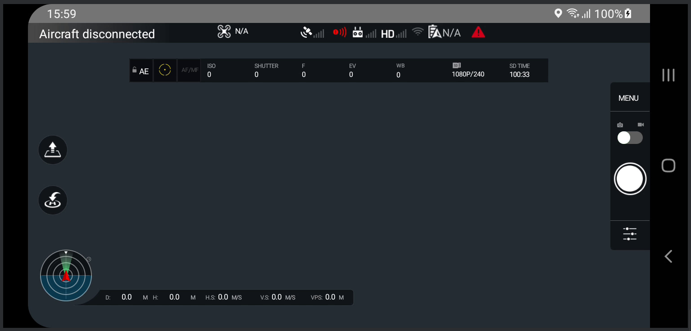

# Derivação do projeto Android-UXSDKDemo

## Introduction

This UXSDKDemo is designed for you to gain a basic understanding of the DJI Android UX SDK. you will learn how to use DJI Android UX SDK and DJI Android SDK to create a fully functioning mini-DJI Go app easily, with standard DJI Go UIs and functionalities. 

## Requirements

 - Android Studio 2.0+
 - Android System 4.1+
 - DJI Android SDK 4.16.1
 - DJI Android UX SDK 4.16

## Tutorial

For this demo's tutorial: **Getting Started with DJI UX SDK**, please refer to <https://developer.dji.com/mobile-sdk/documentation/android-tutorials/UXSDKDemo.html>.

## Feedback

We’d love to hear your feedback on this demo and tutorial.

Please use [DJI Support] (https://djisdksupport.zendesk.com/hc/requests/new)  when you meet any problems of using this demo. At a minimum please let us know:

* Which DJI Product you are using?
* Which Android Device and Android System version you are using?
* Which Android Studio version you are using?
* A short description of your problem includes debugging logs or screenshots.
* Any bugs or typos you come across.

## License

Android-UXSDKDemo is available under the MIT license. Please see the LICENSE file for more info.

## Join Us

DJI is looking for all kinds of Software Engineers to continue building the Future of Possible. Available positions in Shenzhen, China and around the world. If you are interested, please send your resume to <software-sz@dji.com>. For more details, and list of all our global offices, please check <https://we.dji.com/jobs_en.html>.

DJI 招软件工程师啦，based在深圳，如果你想和我们一起把DJI产品做得更好，请发送简历到 <software-sz@dji.com>.  详情请浏览 <https://we.dji.com/zh-CN/recruitment>.
